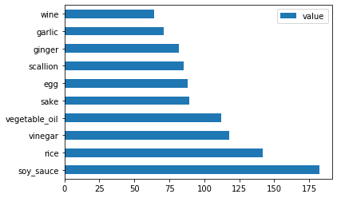
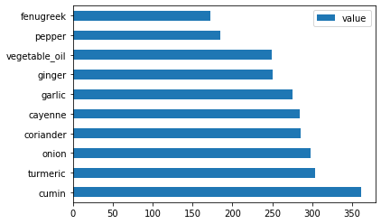
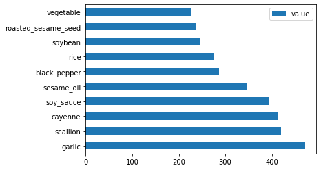

# 分类介绍

在这四节课中，你将探索经典机器学习的一个基本重点 - _分类_。我们将使用各种分类算法，通过一个关于亚洲和印度所有美食的数据集来进行分类。希望你饿了！ 


> 在这些课程中庆祝泛亚美食!作者[Jen Looper](https://twitter.com/jenlooper)

分类是一种[监督学习](https://wikipedia.org/wiki/Supervised_learning)，这与回归技术有很多共同点。如果机器学习都是用数据集来预测事物的值或名称，那么分类一般分为两类：二元分类和多元分类。

[](https://youtu.be/eg8DJYwdMyg "分类介绍")

> 🎥 点击上图观看视频：麻省理工学院的John Guttag介绍分类 

回忆一下:

- **线性回归**帮助你预测变量之间的关系，并准确预测新数据点与该线的关系。因此，例如，你可以预测_南瓜在9月与12月的价格_。
- **逻辑回归**帮助你发现“二元类别”：例如，在这个价位上，_这个南瓜是橙色还是非橙色_？ 

分类使用各种算法来确定给定数据点标签或类别的其他方式。让我们使用这些美食数据，看看我们是否可以通过观察一组食材来确定其美食的来源。 

## [课前测](https://jolly-sea-0a877260f.azurestaticapps.net/quiz/19/)

### 介绍

分类是机器学习研究者和数据科学家的基本活动之一。从二元分类（“这是不是垃圾邮件？”），到使用计算机视觉的复杂图像分类和分割，能够将数据分类并提出问题总是很有用的。

为了更科学地描述过程，你的分类方法会创建一个预测模型，使你能够将输入变量与输出变量之间的关系映射到一起。


> 分类算法要处理的二元分类与多元分类问题。作者[Jen Looper](https://twitter.com/jenlooper)

在开始清理数据、可视化数据以及为ML任务准备数据之前，让我们先了解一下机器学习可用于对数据进行分类的各种方式。

源自[统计](https://wikipedia.org/wiki/Statistical_classification)，使用经典机器学习的分类使用诸如`吸烟者`、`体重`和`年龄`等特征来确定_患某疾病的可能性_。作为类似于你之前执行的回归练习的监督学习技术，你的数据被标记，ML算法使用这些标签对数据集的类别（或“特征”）进行分类和预测，并将它们分配给一个组或结果。

✅ 花点时间想象一个关于美食的数据集。多元模型能够回答什么？ 二元模型能够回答什么？ 如果你想确定给定的菜肴是否可能使用胡芦巴怎么办？ 如果你想看看，给一个装满八角、朝鲜蓟、花椰菜和辣根的杂货袋，你是否可以制作出典型的印度菜？ 

[](https://youtu.be/GuTeDbaNoEU "疯狂的神秘篮子")

> 🎥 点击上图观看视频。“Chopped”节目提供“神秘篮子”，厨师们必须在那里随意选择一些配料来做菜。一个ML模型肯定会有帮助！ 

## 你好“分类器” 

我们想问这个美食数据集的问题实际上是一个**多元分类问题**，因为我们有几个潜在的国家美食可以使用。给定一批配料，这些数据将符合以下哪一类？

Scikit-learn提供了几种不同的算法用于对数据进行分类，具体取决于你要解决的问题类型。在接下来的两课中，你将了解其中的几种算法。

## 练习 - 清理和平衡数据

在开始这个项目之前，手头的第一项任务是清理和**平衡**你的数据以获得更好的结果。 从文件夹根目录中的空白_notebook.ipynb_文件开始。

首先要安装的是[imblearn](https://imbalanced-learn.org/stable/)。这是一个Scikit-learn包，可让你更好地平衡数据（你将在一分钟内了解有关此任务的更多信息）。 

1. 要安装`imblearn`，请运行`pip install`，如下所示：

    ```python
    pip install imblearn
    ```

1. 导入所需的包用于导入数据并对其进行可视化，同时从`imblearn`导入`SMOTE`。

    ```python
    import pandas as pd
    import matplotlib.pyplot as plt
    import matplotlib as mpl
    import numpy as np
    from imblearn.over_sampling import SMOTE
    ```

    现在你已准备好接下来读取导入数据。

1. 下一个任务是导入数据： 

    ```python
    df  = pd.read_csv('../data/cuisines.csv')
    ```

   使用`read_csv()`将读取csv文件_cusines.csv_的内容并将其放入变量`df`中。

1. 检查数据的形状： 

    ```python
    df.head()
    ```

   前五行如下所示：

    ```output
    |     | Unnamed: 0 | cuisine | almond | angelica | anise | anise_seed | apple | apple_brandy | apricot | armagnac | ... | whiskey | white_bread | white_wine | whole_grain_wheat_flour | wine | wood | yam | yeast | yogurt | zucchini |
    | --- | ---------- | ------- | ------ | -------- | ----- | ---------- | ----- | ------------ | ------- | -------- | --- | ------- | ----------- | ---------- | ----------------------- | ---- | ---- | --- | ----- | ------ | -------- |
    | 0   | 65         | indian  | 0      | 0        | 0     | 0          | 0     | 0            | 0       | 0        | ... | 0       | 0           | 0          | 0                       | 0    | 0    | 0   | 0     | 0      | 0        |
    | 1   | 66         | indian  | 1      | 0        | 0     | 0          | 0     | 0            | 0       | 0        | ... | 0       | 0           | 0          | 0                       | 0    | 0    | 0   | 0     | 0      | 0        |
    | 2   | 67         | indian  | 0      | 0        | 0     | 0          | 0     | 0            | 0       | 0        | ... | 0       | 0           | 0          | 0                       | 0    | 0    | 0   | 0     | 0      | 0        |
    | 3   | 68         | indian  | 0      | 0        | 0     | 0          | 0     | 0            | 0       | 0        | ... | 0       | 0           | 0          | 0                       | 0    | 0    | 0   | 0     | 0      | 0        |
    | 4   | 69         | indian  | 0      | 0        | 0     | 0          | 0     | 0            | 0       | 0        | ... | 0       | 0           | 0          | 0                       | 0    | 0    | 0   | 0     | 1      | 0        |
    ```

1. 通过调用`info()`获取有关此数据的信息： 

    ```python
    df.info()
    ```

    输出类似于： 

    ```output
    <class 'pandas.core.frame.DataFrame'>
    RangeIndex: 2448 entries, 0 to 2447
    Columns: 385 entries, Unnamed: 0 to zucchini
    dtypes: int64(384), object(1)
    memory usage: 7.2+ MB
    ```

## 练习 - 学习美食 

现在这项工作开始变得更有趣了。让我们发现菜系的数据分布 

1. 通过调用`barh()`将数据绘制为柱状图：

    ```python
    df.cuisine.value_counts().plot.barh()
    ```

    

    菜系数量有限，但数据分布不均。你可以解决这个问题！在这样做之前，多探索一点。 

1. 找出每种菜系有多少可用数据并将其打印出来： 

    ```python
    thai_df = df[(df.cuisine == "thai")]
    japanese_df = df[(df.cuisine == "japanese")]
    chinese_df = df[(df.cuisine == "chinese")]
    indian_df = df[(df.cuisine == "indian")]
    korean_df = df[(df.cuisine == "korean")]
    
    print(f'thai df: {thai_df.shape}')
    print(f'japanese df: {japanese_df.shape}')
    print(f'chinese df: {chinese_df.shape}')
    print(f'indian df: {indian_df.shape}')
    print(f'korean df: {korean_df.shape}')
    ```

    输出如下所示： 

    ```output
    thai df: (289, 385)
    japanese df: (320, 385)
    chinese df: (442, 385)
    indian df: (598, 385)
    korean df: (799, 385)
    ```

## 研究成分 

现在，你可以更深入地挖掘数据并了解每种菜肴的典型成分是什么。你应该清除在菜系之间造成混淆的重复数据，让我们了解这个问题。 

1. 在Python中创建一个函数`create_ingredient()`来创建一个成分dataframe。此功能将首先删除一个无用的列，并按数量对成分进行排序：

    ```python
    def create_ingredient_df(df):
        ingredient_df = df.T.drop(['cuisine','Unnamed: 0']).sum(axis=1).to_frame('value')
        ingredient_df = ingredient_df[(ingredient_df.T != 0).any()]
        ingredient_df = ingredient_df.sort_values(by='value', ascending=False
        inplace=False)
        return ingredient_df
    ```

   现在，你可以使用该功能来了解各菜系最受欢迎的十大食材。 

1. 调用`create_ingredient()`并调用`barh()`绘制柱状图： 

    ```python
    thai_ingredient_df = create_ingredient_df(thai_df)
    thai_ingredient_df.head(10).plot.barh()
    ```

    

1. 对日本的数据做同样的事情： 

    ```python
    japanese_ingredient_df = create_ingredient_df(japanese_df)
    japanese_ingredient_df.head(10).plot.barh()
    ```

    

1. 现在是中国： 

    ```python
    chinese_ingredient_df = create_ingredient_df(chinese_df)
    chinese_ingredient_df.head(10).plot.barh()
    ```

    

1. 接着是印度：

    ```python
    indian_ingredient_df = create_ingredient_df(indian_df)
    indian_ingredient_df.head(10).plot.barh()
    ```

    

1. 最后是韩国:

    ```python
    korean_ingredient_df = create_ingredient_df(korean_df)
    korean_ingredient_df.head(10).plot.barh()
    ```

    

1. 现在，通过调用`drop()`删除在不同菜系之间造成混淆的最常见成分： 

   每个人都喜欢米饭，大蒜和姜！ 

    ```python
    feature_df= df.drop(['cuisine','Unnamed: 0','rice','garlic','ginger'], axis=1)
    labels_df = df.cuisine #.unique()
    feature_df.head()
    ```

## 平衡数据集 

现在你已经清理了数据，使用[SMOTE](https://imbalanced-learn.org/dev/references/generated/imblearn.over_sampling.SMOTE.html) - “人工少数类过采样法” - 来平衡它。

1. 调用`fit_resample()`，通过插值生成新样本。 

    ```python
    oversample = SMOTE()
    transformed_feature_df, transformed_label_df = oversample.fit_resample(feature_df, labels_df)
    ```

    通过平衡你的数据，你将在分类时获得更好的结果。考虑二元分类。如果你的大部分数据是一个类，那么ML模型将更频繁地预测该类，因为它有更多数据。平衡数据接受任何倾斜的数据，并有助于消除这种不平衡。 

1. 现在你可以检查每种成分的标签数量： 

    ```python
    print(f'new label count: {transformed_label_df.value_counts()}')
    print(f'old label count: {df.cuisine.value_counts()}')
    ```

    输出如下所示： 

    ```output
    new label count: korean      799
    chinese     799
    indian      799
    japanese    799
    thai        799
    Name: cuisine, dtype: int64
    old label count: korean      799
    indian      598
    chinese     442
    japanese    320
    thai        289
    Name: cuisine, dtype: int64
    ```

    数据很好，干净，平衡，非常好吃！ 

1. 最后一步是将你的平衡数据（包括标签和特征）保存到新dataframe中，以便导出到文件： 

    ```python
    transformed_df = pd.concat([transformed_label_df,transformed_feature_df],axis=1, join='outer')
    ```

1. 你可以使用`transformed_df.head()`和`transformed_df.info()`来进一步查看数据。保存此数据的副本以供将来的课程使用： 

    ```python
    transformed_df.head()
    transformed_df.info()
    transformed_df.to_csv("../data/cleaned_cuisine.csv")
    ```

    可以在根数据文件夹中找到这个新的CSV。 

---

## 🚀挑战

本课程包含几个有趣的数据集。挖掘“data”文件夹，看看是否有适合二元或多元分类的数据集？你会问这个数据集什么问题？ 

## [课后测](https://jolly-sea-0a877260f.azurestaticapps.net/quiz/20/)

## 复习与自学 

探索SMOTE的API。它最适合用于哪些用例？它解决了哪些问题？ 

## 任务 

[探索分类方法](../assignment.md)
