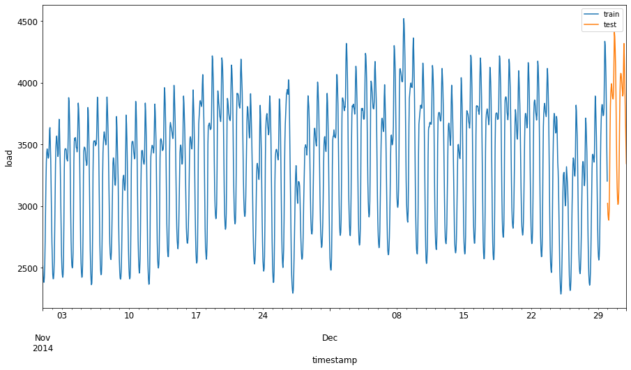
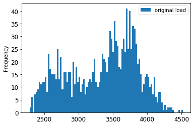
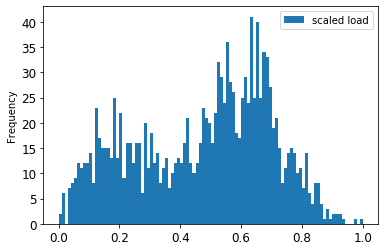
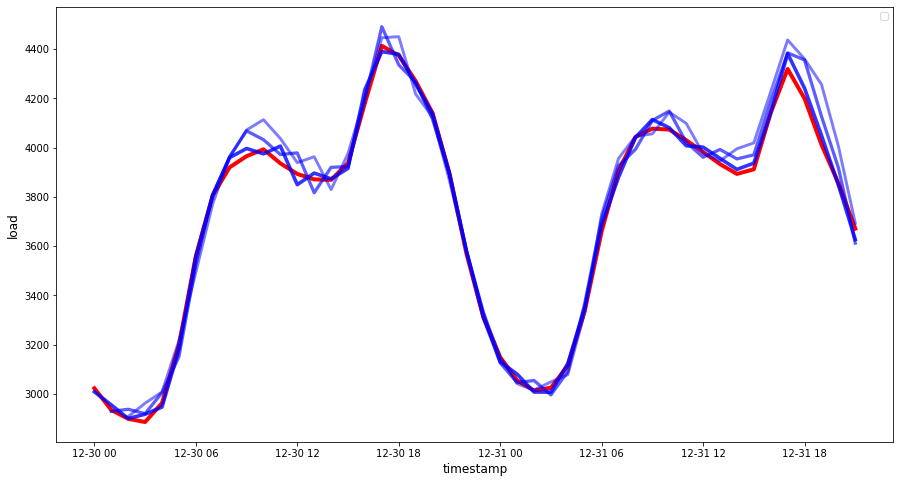

# Predicción de series de tiempo con ARIMA

En la lección anterior, aprendiste un poco acerca de la predicción de series de tiempo y cargaste un conjunto de datos mostrando las fluctuaciones de energía eléctrica a través de un período de tiempo.

[](https://youtu.be/IUSk-YDau10 "Introducción a ARIMA")

> 🎥 Da clic en la imagen de arriba para reproducir el video: Una breve introducción a los modelos de ARIMA. El ejemplo fue hecho en R, pero los conceptos son universales.

## [Examen previo a la lección](https://white-water-09ec41f0f.azurestaticapps.net/quiz/43/)

## Introducción

En esta lección, descubrirás una forma específica de construir modelos con [ARIMA: *A*uto*R*egressive *I*ntegrated *M*oving *A*verage](https://wikipedia.org/wiki/Autoregressive_integrated_moving_average). Los modelos ARIMA son particularmente adecuados para ajustar los datos que muestran [no-estacionariedad](https://wikipedia.org/wiki/Stationary_process).

## Conceptos generales

Para ser capaz de trabajar con ARIMA, hay algunos conceptos que necesitas conocer:

- 🎓 **Estacionariedad**. Desde un contexto estadístico, la estacionariedad se refiere a los datos cuya distribución no cambia cuando se desplaza en el tiempo. Los datos no estacionarios, entonces, muestran fluctuaciones debido a tendencias que deben ser transformadas para ser analizadas. La estacionalidad, por ejemplo, pueden introducir fluctuaciones en los datos y pueden ser eliminados por un proceso de 'diferenciación-estacional'.

- 🎓 **[Diferenciación](https://wikipedia.org/wiki/Autoregressive_integrated_moving_average#Differencing)**. Los datos de diferenciación, de nuevo desde un contexto estadístico, se refieren al proceso de transformar datos no estacionarios para hacerlos estacionarios al eliminar su tendencia no constante. "Diferenciar remueve los cambios en el nivel de una serie de tiempo, eliminando tendencias y estacionalidad, y consecuentemente estabilizando la media de las series de tiempo." [Artículo de Shixiong et al](https://arxiv.org/abs/1904.07632)

## ARIMA en el contexto de series de tiempo

Descifremos las partes de ARIM par aentender mejor cómo nos ayuda a modelar series de tiempo así como a hacer predicciones contra este.

- **AR - para AutoRegresivo**. Los modelos autoregresivos, como su nombre lo implica, miran 'atrás' en el tiempo para analizar valores previos en tus datos y hacer suposiciones acerca de ellos. Estos valores previos son llamados 'lags'. Un ejemplo de sería los datos que muestran las ventas mensuales de lápices. Cada total de ventas por mes sería considerado una 'variable en evolución' en el conjunto de datos. Este modelo es construido como la "variable en evolución de interés se retrocede en sus propios valores (previos) de rezago." [wikipedia](https://wikipedia.org/wiki/Autoregressive_integrated_moving_average)

- **I - para Integrado**. En contraparte a los modelos similares 'ARMA', la 'I' en ARIMA se refiere a su aspecto *[integrado](https://wikipedia.org/wiki/Order_of_integration)*. Los datos son 'integrados' cuando los pasos de diferenciación se aplican para así eliminar la no estacionariedad.

- **MA - para Moving Average**. El aspecto de [media móvil](https://wikipedia.org/wiki/Moving-average_model) de este modelo se refiere a la variable de salida que es determinada al observar los valores actuales y pasados de los lags.

Resultado final: ARIMA es usado para hacer que un modelo se ajuste a la forma especial de los datos de series de tiempo lo mejor posible.

## Ejercicio - Construye un modelo ARIMA

Abre el directorio _/working_ de esta lección y encuentra el archivo _notebook.ipynb_.

1. Ejecuta el notebook para cargar la biblioteca de Python `statsmodels`; necesitarás ésta para los modelos ARIMA.

1. Carga las bibliotecas necesarias.

1. Ahora, carga algunas bibliotecas útiles más para graficar datos:

    ```python
    import os
    import warnings
    import matplotlib.pyplot as plt
    import numpy as np
    import pandas as pd
    import datetime as dt
    import math

    from pandas.plotting import autocorrelation_plot
    from statsmodels.tsa.statespace.sarimax import SARIMAX
    from sklearn.preprocessing import MinMaxScaler
    from common.utils import load_data, mape
    from IPython.display import Image

    %matplotlib inline
    pd.options.display.float_format = '{:,.2f}'.format
    np.set_printoptions(precision=2)
    warnings.filterwarnings("ignore") # specify to ignore warning messages
    ```

1. Carga los datos del archivo `/data/energy.csv` en un dataframe de Pandas y da un vistazo:

    ```python
    energy = load_data('./data')[['load']]
    energy.head(10)
    ```

1. Grafica todos los datos de energía disponibles desde Enero de 2012 a Diciembre de 2014. No debe haber sorpresas ya que vimos estos datos en la última lección:

    ```python
    energy.plot(y='load', subplots=True, figsize=(15, 8), fontsize=12)
    plt.xlabel('timestamp', fontsize=12)
    plt.ylabel('load', fontsize=12)
    plt.show()
    ```

    Ahora, ¡construyamos un modelo!

### Crea conjuntos de datos de prueba y entrenamiento

Ahora que tus datos están cargados, puedes separarlos en conjuntos de entrenamiento y prueba. Entrenarás tu modelo en el conjunto de entrenamiento. Como siempre, después que el modelo terminó su entrenamiento, evaluarás su precisión usando un conjunto de pruebas. Necesitas asegurar el conjunto de pruebas cubra un período posterior en tiempo al conjunto de entrenamiento para así asegurar que el modelo no obtiene información de futuros períodos.

1. Asigna un período de dos meses desde el 1 de Septiembre al 31 de Octubre de 2014 para el conjunto de entrenamiento. El conjunto de pruebas incluirá el período de dos meses del 1 de Noviembre al 31 de Diciembre de 2014:

    ```python
    train_start_dt = '2014-11-01 00:00:00'
    test_start_dt = '2014-12-30 00:00:00'
    ```

    Ya que estos datos reflejan el consumo diario de energía, hay un fuerte patrón estacional, pero el consumo mayormente similar a el consumo en días más recientes.

1. Visualiza las diferencias:

    ```python
    energy[(energy.index < test_start_dt) & (energy.index >= train_start_dt)][['load']].rename(columns={'load':'train'}) \
        .join(energy[test_start_dt:][['load']].rename(columns={'load':'test'}), how='outer') \
        .plot(y=['train', 'test'], figsize=(15, 8), fontsize=12)
    plt.xlabel('timestamp', fontsize=12)
    plt.ylabel('load', fontsize=12)
    plt.show()
    ```

    

    Por lo tanto, usando una ventana de tiempo relativamente pequeña para entrenar los datos debería ser suficiente.

    > Nota: Ya que la función que usamos para ajustar el modelo ARIMA usa una validación en la muestra durante el ajuste, omitiremos la validación de los datos.

### Prepara los datos para entrenamiento

Ahora, necesitas preparar los datos para entrenar al realizar filtrado y escalado de tus datos. Filtra tu conjunto de datos para sólo incluir los períodos de tiempo y columnas que necesitas, y escala para asegurar que tus datos son proyectados en un intervalo 0,1.

1. Filtra el conjunto de datos original para incluir sólo los ya mencionados períodos de tiempo por conjunto y sólo incluyendo las columnas necesarias  'load' más date: 

    ```python
    train = energy.copy()[(energy.index >= train_start_dt) & (energy.index < test_start_dt)][['load']]
    test = energy.copy()[energy.index >= test_start_dt][['load']]

    print('Training data shape: ', train.shape)
    print('Test data shape: ', test.shape)
    ```

    You can see the shape of the data:

    ```output
    Training data shape:  (1416, 1)
    Test data shape:  (48, 1)
    ```

1. Escala los datos que estén en el rango (0, 1).

    ```python
    scaler = MinMaxScaler()
    train['load'] = scaler.fit_transform(train)
    train.head(10)
    ```

1. Visualiza los datos originales vs los escalados:

    ```python
    energy[(energy.index >= train_start_dt) & (energy.index < test_start_dt)][['load']].rename(columns={'load':'original load'}).plot.hist(bins=100, fontsize=12)
    train.rename(columns={'load':'scaled load'}).plot.hist(bins=100, fontsize=12)
    plt.show()
    ```

    

    > Los datos originales

    

    > Los datos escalados

1. Ahora que has calibrado los datos escalados, puedes escalar los datos de prueba:

    ```python
    test['load'] = scaler.transform(test)
    test.head()
    ```

### Implementa ARIMA

¡Es hora de implementar ARIMA! Ahora usarás la biblioteca `statsmodels` que instalaste anteriormente.

Ahora necesitas seguir varios pasos

   1. Define el modelo llamando a `SARIMAX()` y pasando en el modelo los parámetros: p, d y q, así como P, D y Q.
   2. Prepara el modelo para entrenamiento llamando la función `fit()`.
   3. Haz predicciones llamando a la función `forecast()` y especificando el número de pasos (el `horizonte`) a predecir.

> 🎓 ¿Para qué son todos estos parámetros? En un modelo de ARIMA hay 3 parámetros que son usados para ayudar a modelar los aspectos principales de una serie de tiempo: estacionalidad, tendencia y ruido. Estos parámetros son:

`p`: el parámetro asociado con el aspecto auto-regresivo del modelo, el cual incorpora valores *pasados*.
`d`: el parámetro asociado con la parte integrada del modelo, el cual afecta a la cantidad de *diferenciación* (🎓 recuerdas la diferenciación 👆?) a aplicar a una serie de tiempo.
`q`: el parámetro asociado con la parte media-móvil del modelo.

> Nota: Si tus datos tienen un aspecto estacional - el cual tiene este - , usamos un modelo estacional de ARIMA (SARIMA). En ese caso necesitas usar otro conjunto de parámetros: `P`, `D`, y `Q` el cual describe las mismas asociaciones como `p`, `d`, y `q`, pero correspondientes a los componentes estacionales del modelo.

1. Inicia configurando tu valor horizonte preferido. Probemos con 3 horas:

    ```python
    # Specify the number of steps to forecast ahead
    HORIZON = 3
    print('Forecasting horizon:', HORIZON, 'hours')
    ```

    Seleccionar los mejores valores para los parámetros de un modelo ARIMA puede ser desafiante ya que es algo subjetivo y requiere mucho tiempo. Puedes considerar usar una función `auto_arima()` de la [biblioteca `pyramid`](https://alkaline-ml.com/pmdarima/0.9.0/modules/generated/pyramid.arima.auto_arima.html),

1. Por ahora prueba algunas selecciones manuales para encontrar un buen modelo.

    ```python
    order = (4, 1, 0)
    seasonal_order = (1, 1, 0, 24)

    model = SARIMAX(endog=train, order=order, seasonal_order=seasonal_order)
    results = model.fit()

    print(results.summary())
    ```

    Se imprime una tabla de resultados.

¡Has construido tu primer modelo! Ahora necesitamos encontrar una forma de evaluarlo.

### Evalúa tu modelo

Para evaluar tu modelo, puedes realizar la validación llamada `walk forward`. En la práctica, los modelos de series de tiempo son re-entrenados cada vez que están disponibles nuevos datos. Esto permite al modelo realizar la mejor predicción en cada paso de tiempo.

Comenzando al principio de las series de tiempo usando esta técnica, entrena el modelo con el conjunto de datos de entrenamiento. Luego haz una predicción del siguiente paso de tiempo. La predicción es evaluada contra el valor conocido. El conjunto de entrenamiento después es expandido para incluir el valor conocido y el proceso se repite.

> Nota: Debes mantener fija la ventana del conjunto de entrenamiento para un entrenamiento más eficiente y así cada vez que agregues una nueva observación al conjunto de entrenamiento, la remuevas del comienzo del conjunto.

Este proceso provee una estimación más robusta de cómo se comportará el modelo en la práctica. Sin embargo, presenta un costo de computación con la creación de demasiados modelos. Esto es aceptable si los datos son pequeños o si el modelo es simple, pero podría ser un problema en escala.

La validación walk-forward es el estándar dorado de la evaluación de modelos de series de tiempo y se recomienda para proyectos propios.

1. Primero, crea un punto de datos de prueba para cada paso HORIZON.

    ```python
    test_shifted = test.copy()

    for t in range(1, HORIZON+1):
        test_shifted['load+'+str(t)] = test_shifted['load'].shift(-t, freq='H')

    test_shifted = test_shifted.dropna(how='any')
    test_shifted.head(5)
    ```

    |            |          | load | load+1 | load+2 |
    | ---------- | -------- | ---- | ------ | ------ |
    | 2014-12-30 | 00:00:00 | 0.33 | 0.29   | 0.27   |
    | 2014-12-30 | 01:00:00 | 0.29 | 0.27   | 0.27   |
    | 2014-12-30 | 02:00:00 | 0.27 | 0.27   | 0.30   |
    | 2014-12-30 | 03:00:00 | 0.27 | 0.30   | 0.41   |
    | 2014-12-30 | 04:00:00 | 0.30 | 0.41   | 0.57   |

    los datos son desplazados horizontalmente de acuerdo a su punto horizonte.

1. Haz predicciones en tus datos de prueba usando este enfoque de ventana deslizable en un bucle del tamaño de la longitud de los datos de prueba:

    ```python
    %%time
    training_window = 720 # dedicate 30 days (720 hours) for training

    train_ts = train['load']
    test_ts = test_shifted

    history = [x for x in train_ts]
    history = history[(-training_window):]

    predictions = list()

    order = (2, 1, 0)
    seasonal_order = (1, 1, 0, 24)

    for t in range(test_ts.shape[0]):
        model = SARIMAX(endog=history, order=order, seasonal_order=seasonal_order)
        model_fit = model.fit()
        yhat = model_fit.forecast(steps = HORIZON)
        predictions.append(yhat)
        obs = list(test_ts.iloc[t])
        # move the training window
        history.append(obs[0])
        history.pop(0)
        print(test_ts.index[t])
        print(t+1, ': predicted =', yhat, 'expected =', obs)
    ```

    Puedes ver cómo se desarrolla el entrenamiento:

    ```output
    2014-12-30 00:00:00
    1 : predicted = [0.32 0.29 0.28] expected = [0.32945389435989236, 0.2900626678603402, 0.2739480752014323]

    2014-12-30 01:00:00
    2 : predicted = [0.3  0.29 0.3 ] expected = [0.2900626678603402, 0.2739480752014323, 0.26812891674127126]

    2014-12-30 02:00:00
    3 : predicted = [0.27 0.28 0.32] expected = [0.2739480752014323, 0.26812891674127126, 0.3025962399283795]
    ```

1. Compara las predicciones con la carga real:

    ```python
    eval_df = pd.DataFrame(predictions, columns=['t+'+str(t) for t in range(1, HORIZON+1)])
    eval_df['timestamp'] = test.index[0:len(test.index)-HORIZON+1]
    eval_df = pd.melt(eval_df, id_vars='timestamp', value_name='prediction', var_name='h')
    eval_df['actual'] = np.array(np.transpose(test_ts)).ravel()
    eval_df[['prediction', 'actual']] = scaler.inverse_transform(eval_df[['prediction', 'actual']])
    eval_df.head()
    ```

    Salida
    |     |            | timestamp | h   | prediction | actual   |
    | --- | ---------- | --------- | --- | ---------- | -------- |
    | 0   | 2014-12-30 | 00:00:00  | t+1 | 3,008.74   | 3,023.00 |
    | 1   | 2014-12-30 | 01:00:00  | t+1 | 2,955.53   | 2,935.00 |
    | 2   | 2014-12-30 | 02:00:00  | t+1 | 2,900.17   | 2,899.00 |
    | 3   | 2014-12-30 | 03:00:00  | t+1 | 2,917.69   | 2,886.00 |
    | 4   | 2014-12-30 | 04:00:00  | t+1 | 2,946.99   | 2,963.00 |


    Observa la predicción de datos por hora, comparada con la carga real. ¿Qué tan precisa es?

### Comprueba la precisión del modelo

Comprueba la precisión de tu modelo al probar su error porcentual absoluto medio (MAPE) sobre todas las predicciones.

> **🧮 Muéstrame las matemáticas**
>
> 
>
>  [MAPE](https://www.linkedin.com/pulse/what-mape-mad-msd-time-series-allameh-statistics/) se usa para mostrar la precisión de predicción como una proporción definida por la fórmula de arriba. La diferencia entre <sub>t</sub> real <sub>t</sub> predicha es dividida por la <sub>t</sub> real. "El valor absoluto en este cálculo es sumado por cada punto pronosticado en el tiempo y dividido por el número n de puntos ajustados." [wikipedia](https://wikipedia.org/wiki/Mean_absolute_percentage_error)

1. Expresa lacuación en código:

    ```python
    if(HORIZON > 1):
        eval_df['APE'] = (eval_df['prediction'] - eval_df['actual']).abs() / eval_df['actual']
        print(eval_df.groupby('h')['APE'].mean())
    ```

1. Calculate el MAPE de un paso:

    ```python
    print('One step forecast MAPE: ', (mape(eval_df[eval_df['h'] == 't+1']['prediction'], eval_df[eval_df['h'] == 't+1']['actual']))*100, '%')
    ```

    Pronóstico de un paso MAPE:  0.5570581332313952 %

1. Imprime el pronóstico MAPE multi-paso:

    ```python
    print('Multi-step forecast MAPE: ', mape(eval_df['prediction'], eval_df['actual'])*100, '%')
    ```

    ```output
    Multi-step forecast MAPE:  1.1460048657704118 %
    ```

    Un número bajo es lo mejor: considera que la predicción que tiene un MAPE de 10 está equivocado en un 10%.

1. Pero como siempre, es más fácil ver este tipo de medición de precisión de forma visual, así que grafiquémoslo:

    ```python
     if(HORIZON == 1):
        ## Plotting single step forecast
        eval_df.plot(x='timestamp', y=['actual', 'prediction'], style=['r', 'b'], figsize=(15, 8))

    else:
        ## Plotting multi step forecast
        plot_df = eval_df[(eval_df.h=='t+1')][['timestamp', 'actual']]
        for t in range(1, HORIZON+1):
            plot_df['t+'+str(t)] = eval_df[(eval_df.h=='t+'+str(t))]['prediction'].values

        fig = plt.figure(figsize=(15, 8))
        ax = plt.plot(plot_df['timestamp'], plot_df['actual'], color='red', linewidth=4.0)
        ax = fig.add_subplot(111)
        for t in range(1, HORIZON+1):
            x = plot_df['timestamp'][(t-1):]
            y = plot_df['t+'+str(t)][0:len(x)]
            ax.plot(x, y, color='blue', linewidth=4*math.pow(.9,t), alpha=math.pow(0.8,t))

        ax.legend(loc='best')

    plt.xlabel('timestamp', fontsize=12)
    plt.ylabel('load', fontsize=12)
    plt.show()
    ```

    

🏆 Un gráfico muy bonito, mostrando un modelo con una buena precisión. ¡Bien hecho!

---

## 🚀Desafío

Indaga en las formas de probar la precisión de un modelo de series de tiempo. Nosotros abordamos MAPE en esta lección, pero ¿hay otros métodos que pudieras usar? Investiga y anota cuáles son. Puedes encontrar un documento útil [aquí](https://otexts.com/fpp2/accuracy.html)

## [Examen posterior a la lección](https://white-water-09ec41f0f.azurestaticapps.net/quiz/44/)

## Revisión y auto-estudio

Esta lección aborda sólo las bases de la predicción de series de tiempo con ARIMA. Toma algo de tiempo para profundizar tu conocimiento indagando en [este repositorio](https://microsoft.github.io/forecasting/) y sus distintos tipos de modelos para aprender otras formas de construir modelos de series de tiempo.

## Asignación

[Un nuevo modelo ARIMA](../translations/assignment.es.md)
