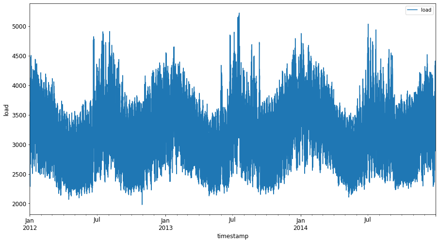
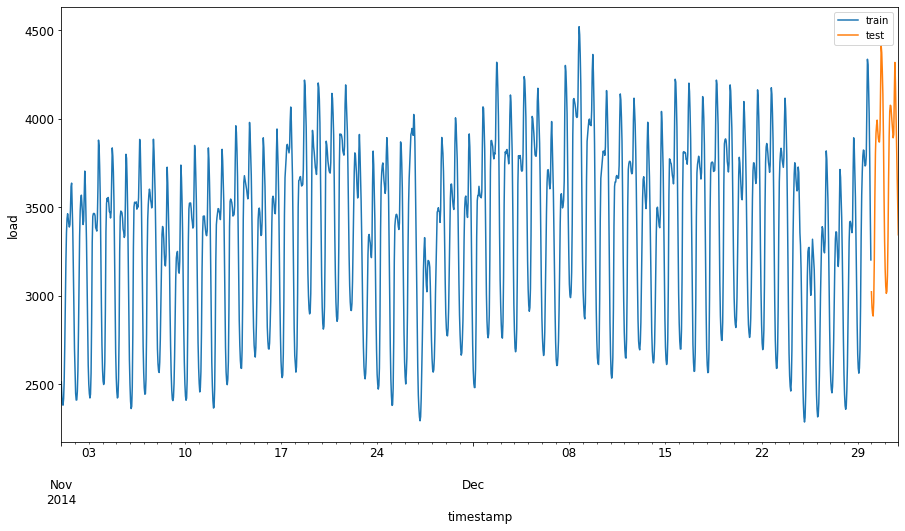

# Time series forecasting with Support Vector Regressor

In the previous lesson, you learned how to use ARIMA model to make time series predictions. Now you'll be looking at Support Vector Regressor model which is a regressor model used to predict continuous data.


## Introduction

In this lesson, you will discover a specific way to build models with [**SVM**: **S**upport **V**ector **M**achine](https://en.wikipedia.org/wiki/Support-vector_machine) for regression, or **SVR: Support Vector Regressor**. 

### SVR in the context of time series[^2]

Before understanding the importance of SVR in time series prediction, here are some of the important concepts that you need to know:

- **Regression:** Supervised learning technique to predict continuous values from a given set of inputs. The idea is to fit a curve (or line) in the feature space that has the maximum number of data points.
- **Support Vector Machine (SVM):** A type of supervised machine learning model used for classification, regression and outliers detection. The model is a hyperplane in the feature space, which in case of classification acts as a boundary, and in case of regression acts as the best-fit line. In SVM, a Kernel function is generally used to transform the dataset, so that a non-linear decision surface is able to transform to a linear equation in a higher number of dimension spaces.
- **Support Vector Regressor (SVR):** A type of SVM, to find the best fit line (which in the case of SVM is a hyperplane) that has the maximum number of data points.

### Why SVR?[^2]

In the last lesson you learned about ARIMA, which is a very successful statistical linear method to forecast time series data. However, in many cases, time series data have *non-linearity*, which cannot be mapped by linear models. In such cases, the ability of SVM to consider non-linearity in the data for regression tasks makes SVR successful in time series forecasting.

## Exercise - build an SVR model

The first few steps for data preparation are the same as that of the previous lesson. Open the _/working_ folder in this lesson and find the _notebook.ipynb_ file.

1. Run the notebook and import the necessary libraries: [^1]

   ```python
   import os
   import warnings
   import matplotlib.pyplot as plt
   import numpy as np
   import pandas as pd
   import datetime as dt
   import math
   
   from sklearn.svm import SVR
   from sklearn.preprocessing import MinMaxScaler
   from common.utils import load_data, mape
   ```

4. Load the data from the `/data/energy.csv` file into a Pandas dataframe and take a look: [^1]

   ```python
   energy = load_data('./data')[['load']]
   ```
   
5. Plot all the available energy data from January 2012 to December 2014:[^1]

   ```python
   energy.plot(y='load', subplots=True, figsize=(15, 8), fontsize=12)
   plt.xlabel('timestamp', fontsize=12)
   plt.ylabel('load', fontsize=12)
   plt.show()
   ```

   
   
   Now, let's build our SVR model.

### Create training and testing datasets

Now your data is loaded, so you can separate it into train and test sets. Then you'll reshape the data to create a time-step based dataset which will be needed for the SVR. You'll train your model on the train set. After the model has finished training, you'll evaluate its accuracy on the training set, testing set and then the full dataset to see the overall performance. You need to ensure that the test set covers a later period in time from the training set to ensure that the model does not gain information from future time periods (a situation known as *Overfitting*).[^1]

1. Allocate a two-month period from September 1 to October 31, 2014 to the training set. The test set will include the two-month period of November 1 to December 31, 2014:[^1]

   ```python
   train_start_dt = '2014-11-01 00:00:00'
   test_start_dt = '2014-12-30 00:00:00'
   ```

2. Visualize the differences:[^1]

   ```python
   energy[(energy.index < test_start_dt) & (energy.index >= train_start_dt)][['load']].rename(columns={'load':'train'}) \
       .join(energy[test_start_dt:][['load']].rename(columns={'load':'test'}), how='outer') \
       .plot(y=['train', 'test'], figsize=(15, 8), fontsize=12)
   plt.xlabel('timestamp', fontsize=12)
   plt.ylabel('load', fontsize=12)
   plt.show()
   ```

   


### Prepare the data for training

Now, you need to prepare the data for training by performing filtering and scaling of your data. Filter your dataset to only include the time periods and columns you need, and scaling to ensure the data is projected in the interval 0,1.

1. Filter the original dataset to include only the aforementioned time periods per set and only including the needed column 'load' plus the date:[^1]

   ```python
   train = energy.copy()[(energy.index >= train_start_dt) & (energy.index < test_start_dt)][['load']]
   test = energy.copy()[energy.index >= test_start_dt][['load']]
   
   print('Training data shape: ', train.shape)
   print('Test data shape: ', test.shape)
   ```

   ```output
   Training data shape:  (1416, 1)
   Test data shape:  (48, 1)
   ```
   
2. Scale the training data to be in the range (0, 1):[^1]

   ```python
   scaler = MinMaxScaler()
   train['load'] = scaler.fit_transform(train)
   ```
   
4. Now, you scale the testing data:[^1]

   ```python
   test['load'] = scaler.transform(test)
   ```

### Create data with time-steps[^2]

For the SVR, you transform the input data to be of the form `[batch, timesteps]`. So, you reshape the existing `train_data` and `test_data` such that there is a new dimension which refers to the timesteps. 

```python
# Converting to numpy arrays
train_data = train.values
test_data = test.values
```

For this example, we take `timesteps = 5`. So, the inputs to the model are the data for the first 4 timesteps, and the output will be the data for the 5th timestep.

```python
timesteps=5
```

Converting training data to 2D tensor using nested list comprehension:

```python
train_data_timesteps=np.array([[j for j in train_data[i:i+timesteps]] for i in range(0,len(train_data)-timesteps+1)])[:,:,0]
train_data_timesteps.shape
```

```output
(1412, 5)
```

Converting testing data to 2D tensor:

```python
test_data_timesteps=np.array([[j for j in test_data[i:i+timesteps]] for i in range(0,len(test_data)-timesteps+1)])[:,:,0]
test_data_timesteps.shape
```

```output
(44, 5)
```

 Selecting inputs and outputs from training and testing data:

```python
x_train, y_train = train_data_timesteps[:,:timesteps-1],train_data_timesteps[:,[timesteps-1]]
x_test, y_test = test_data_timesteps[:,:timesteps-1],test_data_timesteps[:,[timesteps-1]]

print(x_train.shape, y_train.shape)
print(x_test.shape, y_test.shape)
```

```output
(1412, 4) (1412, 1)
(44, 4) (44, 1)
```

### Implement SVR[^2]

Now, It's time to implement SVR:

  1. Define the model by calling `SVR()` and passing in the model hyperparameters: kernel, gamma, c and epsilon
  2. Prepare the model for the training data by calling the `fit()` function.
  3. Make predictions calling the `predict()` function

Now we create an SVR model. Here we use the [RBF kernel](https://scikit-learn.org/stable/modules/svm.html#parameters-of-the-rbf-kernel), and set the hyperparameters gamma, C and epsilon as 0.5, 10 and 0.05 respectively.

```python
model = SVR(kernel='rbf',gamma=0.5, C=10, epsilon = 0.05)
```

Fit the model on training data

```python
model.fit(x_train, y_train[:,0])
```

```output
SVR(C=10, cache_size=200, coef0=0.0, degree=3, epsilon=0.05, gamma=0.5,
    kernel='rbf', max_iter=-1, shrinking=True, tol=0.001, verbose=False)
```

Make model predictions

```python
y_train_pred = model.predict(x_train).reshape(-1,1)
y_test_pred = model.predict(x_test).reshape(-1,1)

print(y_train_pred.shape, y_test_pred.shape)
```

```output
(1412, 1) (44, 1)
```

You've built your SVR! Now we need to evaluate it.

### Evaluate your model[^2]

For evaluation, first we will scale back the data to our original scale. Then, to check the performance, we will plot the original and predicted time series plot, and also print the MAPE result.

Scale the predicted and original output:

```python
# Scaling the predictions
y_train_pred = scaler.inverse_transform(y_train_pred)
y_test_pred = scaler.inverse_transform(y_test_pred)

print(len(y_train_pred), len(y_test_pred))
```

```python
# Scaling the original values
y_train = scaler.inverse_transform(y_train)
y_test = scaler.inverse_transform(y_test)

print(len(y_train), len(y_test))
```

#### Check model performance on training and testing data[^2]

We extract the timestamps from the dataset to show in the x-axis of our plot. Note that we are using the first ```timesteps-1``` values as out input for the first output, so the timestamps for the output will start after that.

```python
train_timestamps = energy[(energy.index < test_start_dt) & (energy.index >= train_start_dt)].index[timesteps-1:]
test_timestamps = energy[test_start_dt:].index[timesteps-1:]

print(len(train_timestamps), len(test_timestamps))
```

```output
1412 44
```

Plot the predictions for training data:

```python
plt.figure(figsize=(25,6))
plt.plot(train_timestamps, y_train, color = 'red', linewidth=2.0, alpha = 0.6)
plt.plot(train_timestamps, y_train_pred, color = 'blue', linewidth=0.8)
plt.legend(['Actual','Predicted'])
plt.xlabel('Timestamp')
plt.title("Training data prediction")
plt.show()
```


Print MAPE for training data

```python
print('MAPE for training data: ', mape(y_train_pred, y_train)*100, '%')
```

```output
MAPE for training data: 1.7195710200875551 %
```

Plot the predictions for testing data

```python
plt.figure(figsize=(10,3))
plt.plot(test_timestamps, y_test, color = 'red', linewidth=2.0, alpha = 0.6)
plt.plot(test_timestamps, y_test_pred, color = 'blue', linewidth=0.8)
plt.legend(['Actual','Predicted'])
plt.xlabel('Timestamp')
plt.show()
```


Print MAPE for testing data

```python
print('MAPE for testing data: ', mape(y_test_pred, y_test)*100, '%')
```

```output
MAPE for testing data:  1.2623790187854018 %
```

🏆 You have a very good result on the testing dataset!

### Check model performance on full dataset[^2]

```python
# Extracting load values as numpy array
data = energy.copy().values

# Scaling
data = scaler.transform(data)

# Transforming to 2D tensor as per model input requirement
data_timesteps=np.array([[j for j in data[i:i+timesteps]] for i in range(0,len(data)-timesteps+1)])[:,:,0]
print("Tensor shape: ", data_timesteps.shape)

# Selecting inputs and outputs from data
X, Y = data_timesteps[:,:timesteps-1],data_timesteps[:,[timesteps-1]]
print("X shape: ", X.shape,"\nY shape: ", Y.shape)
```

```output
Tensor shape:  (26300, 5)
X shape:  (26300, 4) 
Y shape:  (26300, 1)
```

```python
# Make model predictions
Y_pred = model.predict(X).reshape(-1,1)

# Inverse scale and reshape
Y_pred = scaler.inverse_transform(Y_pred)
Y = scaler.inverse_transform(Y)
```

```python
plt.figure(figsize=(30,8))
plt.plot(Y, color = 'red', linewidth=2.0, alpha = 0.6)
plt.plot(Y_pred, color = 'blue', linewidth=0.8)
plt.legend(['Actual','Predicted'])
plt.xlabel('Timestamp')
plt.show()
```


```python
print('MAPE: ', mape(Y_pred, Y)*100, '%')
```

```output
MAPE:  2.0572089029888656 %
```


🏆 Very nice plots, showing a model with good accuracy. Well done!

---

## 🚀Challenge

- Try to tweak the hyperparameters (gamma, C, epsilon) while creating the model and evaluate on the data to see which set of hyperparameters give the best results on the testing data. To know more about these hyperparameters, you can refer to the  document [here](https://scikit-learn.org/stable/modules/svm.html#parameters-of-the-rbf-kernel). 
- Try to use different kernel functions for the model and analyze their performances on the dataset. A helpful document can be found [here](https://scikit-learn.org/stable/modules/svm.html#kernel-functions).

[^1] Text, code and output taken from [Arima](https://github.com/microsoft/ML-For-Beginners/tree/main/7-TimeSeries/2-ARIMA)

[^2] Text, code and output contributed by [@AnirbanMukherjeeXD](https://github.com/AnirbanMukherjeeXD)