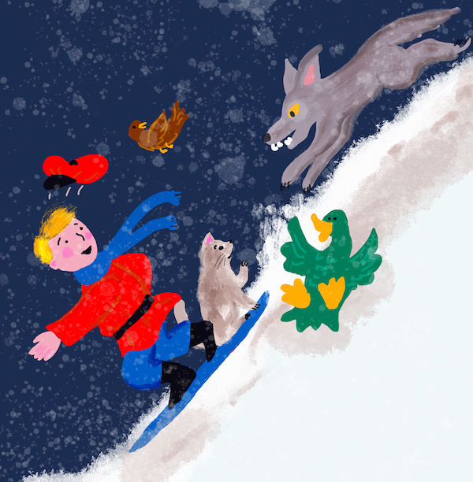

# CartPole Skating

我们在上一课中一直在解决的问题可能看起来像一个玩具问题，并不真正适用于现实生活场景。事实并非如此，因为许多现实世界的问题也有这种情况——包括下国际象棋或围棋。它们很相似，因为我们也有一个具有给定规则和**离散状态**的板。
https://white-water-09ec41f0f.azurestaticapps.net/

## [课前测验](https://gray-sand-07a10f403.1.azurestaticapps.net/quiz/47/)

## 介绍

在本课中，我们将把 Q-Learning 的相同原理应用到具有**连续状态**的问题，比如由一个或多个实数给出的状态。我们将处理以下问题：

> **问题**：如果彼得想要逃离狼群，他需要能够移动得更快。我们将看到彼得如何使用 Q-Learning 学习滑冰，特别是保持平衡。



> 彼得和他的朋友们发挥创意来逃离狼！图片来自 [Jen Looper](https://twitter.com/jenlooper)

我们将使用称为 **CartPole** 问题的简化版版本。在这个世界中，我们有一个可以左右移动的水平滑块，目标是平衡滑块顶部的垂直杆。


## 先决条件

在本课中，我们将使用一个名为 **OpenAI Gym** 的库来模拟不同的 **环境**。你可以在本地（例如从 Visual Studio Code）运行本课程的代码，在这种情况下，模拟将在新窗口中打开。在线运行代码时，你可能需要对代码进行一些调整，如 [此处](https://towardsdatascience.com/rendering-openai-gym-envs-on-binder-and-google-colab-536f99391cc7)。

## OpenAI Gym

在上一课中，游戏规则和状态是由我们自己定义的"Board"类给出的。这里我们将使用一个特殊的**模拟环境**，它将模拟平衡杆后面的物理规则。训练强化学习算法最流行的模拟环境之一称为 [Gym](https://gym.openai.com/)，由 [OpenAI](https://openai.com/) 维护。通过使用这个模拟环境，我们可以创建不同的**环境**，从推车模拟到 Atari 游戏。

> **注意**：你可以在 [此处](https://gym.openai.com/envs/#classic_control) 查看 OpenAI Gym 提供的其他环境。 

首先，让我们安装 gym 并导入所需的库（代码块 1）：

```python
import sys
!{sys.executable} -m pip install gym 

import gym
import matplotlib.pyplot as plt
import numpy as np
import random
```

## 练习 - 初始化一个推车环境

为了解决车杆平衡问题，我们需要初始化相应的环境。每个环境都有以下内容：

- **观察空间**，定义了我们从环境中接收到的信息结构。对于 cartpole 问题，我们接收杆的位置、速度和其他一些值。

- **动作空间**，定义可能的动作。在我们的例子中，动作空间是离散的，由两个动作组成 - **left** 和 **right**。（代码块 2）

1. 要初始化，请键入以下代码：

    ```python
    env = gym.make("CartPole-v1")
    print(env.action_space)
    print(env.observation_space)
    print(env.action_space.sample())
    ```

要查看环境如何工作，让我们运行 100 个步骤的简短模拟。在每一步，我们提供一个要采取的行动——在这个模拟中，我们只是从 "action_space" 中随机选择一个行动。

1. 运行下面的代码，看看它会导致什么。

    ✅ 请记住，最好在本地 Python 安装上运行此代码！（代码块 3）

    ```python
    env.reset()

    for i in range(100):
        env.render()
        env.step(env.action_space.sample())
    env.close()
    ```

    你应该会看到与此图像类似的内容：

    

2. 在模拟过程中，我们需要通过观察来决定如何行动。事实上，step 函数返回当前观察值、奖励函数和指示是否继续模拟有意义的完成标志：（代码块 4）

    ```python
    env.reset()

    done = False
    while not done:
        env.render()
        obs, rew, done, info = env.step(env.action_space.sample())
        print(f"{obs} -> {rew}")
    env.close()
    ```

    你最终会在笔记本输出中看到类似的内容：

    ```text
    [ 0.03403272 -0.24301182 0.02669811 0.2895829 ] -> 1.0
    [ 0.02917248 -0.04828055 0.03248977 0.00543839] -> 1.0
    [ 0.02820687 0.14636075 0.03259854 -0.27681916] -> 1.0
    [ 0.03113408 0.34100283 0.02706215 -0.55904489] -> 1.0
    [ 0.03795414 0.53573468 0.01588125 -0.84308041] -> 1.0
    ...
    [ 0.17299878 0.15868546 -0.20754175 -0.55975453] -> 1.0
    [ 0.17617249 0.35602306 -0.21873684 -0.90998894] -> 1.0
    ```

    在模拟的每一步返回的观察向量包含以下值：
    - 推车的位置
    - 推车速度
    - 杆的角度
    - 杆的转速

1. 获取这些数字的最小值和最大值：（代码块 5）

    ```python
    print(env.observation_space.low)
    print(env.observation_space.high)
    ```

    你可能还注意到，每个模拟步骤的奖励值始终为 1。这是因为我们的目标是尽可能长时间地生存，即在最长的时间内将杆保持在合理的垂直位置。

    ✅ 事实上，如果我们设法在 100 次连续试验中获得 195 的平均奖励，则认为 CartPole 问题已解决。

## 状态离散化

在 Q-Learning 中，我们需要构建 Q-Table 来定义在每个状态下要做什么。为了能够做到这一点，我们需要状态 **discreet**，更准确地说，它应该包含有限数量的离散值。因此，我们需要以某种方式**离散**我们的观察，将它们映射到一组有限的状态。

我们有几种方法可以做到这一点：

- **拆分装箱**。如果我们知道某个值的区间，我们可以把这个区间分成若干个**bins**，然后用它所属的箱子序号替换这个值。这可以使用 [`digitize`](https://numpy.org/doc/stable/reference/generated/numpy.digitize.html) 方法来完成。在这种情况下，我们将精确地知道状态大小，因为它取决于我们选择的箱子数量。
  
✅ 我们可以使用线性插值将值带入某个有限区间（例如，从 -20 到 20），然后通过四舍五入将数字转换为整数。这使我们对状态大小的控制减弱了一点，尤其是当我们不知道输入值的确切范围时。例如，在我们的例子中，4 个值中有 2 个值的值没有上限/下限，这可能会导致无限数量的状态。

在我们的示例中，我们将采用第二种方法。稍后你可能会注意到，尽管有未定义的上限/下限，但这些值很少采用某些有限区间之外的值，因此具有极值的状态将非常罕见。

1. 这是一个函数，它将从我们的模型中获取观察结果并生成一个包含 4 个整数值的元组：（代码块 6）

    ```python
    def discretize(x):
        return tuple((x/np.array([0.25, 0.25, 0.01, 0.1])).astype(np.int))
    ```

2. 让我们也探索另一种使用 bins 的离散化方法：（代码块 7）

    ```python
    def create_bins(i,num):
        return np.arange(num+1)*(i[1]-i[0])/num+i[0]
    
    print("Sample bins for interval (-5,5) with 10 bins\n",create_bins((-5,5),10))
    
    ints = [(-5,5),(-2,2),(-0.5,0.5),(-2,2)] # 每个参数的值间隔
    nbins = [20,20,10,10] # 每个参数的 bin 数量
    bins = [create_bins(ints[i],nbins[i]) for i in range(4)]
    
    def discretize_bins(x):
        return tuple(np.digitize(x[i],bins[i]) for i in range(4))
    ```

3. 现在让我们运行一个简短的模拟并观察那些离散的环境值。随意尝试 `discretize` 和 `discretize_bins` ，看看是否有区别。

    ✅ discretize_bins 返回 bin 编号，从 0 开始。因此，对于0附近 的输入变量值，它返回区间 (10) 中间的数字。在离散化中，我们不关心输出值的范围，允许它们为负，因此状态值不会移位，0 对应于 0。（代码块 8）

    ```python
    env.reset()

    done = False
    while not done:
        #env.render()
        obs, rew, done, info = env.step(env.action_space.sample())
        #print(discretize_bins(obs))
        print(discretize(obs))
    env.close()
    ```

    ✅ 如果你想查看环境如何执行，请取消以 env.render 开头行的注释。或者你可以在后台执行它，这样会更快。我们将在 Q-Learning 过程中使用这种"隐形"执行。

## Q-Table 结构

在我们上一课中，状态是从 0 到 8 的一对简单数字，因此用形状为 8x8x2 的 numpy 张量来表示 Q-Table 很方便。如果我们使用 bins 离散化，我们的状态向量的大小也是已知的，所以我们可以使用相同的方法，用一个形状为 20x20x10x10x2 的数组来表示状态（这里 2 是动作空间的维度，第一个维度对应于我们选择用于观察空间中的每个参数的箱）。

然而，有时不知道观察空间的精确尺寸。在 `discretize` 函数的情况下，我们可能永远无法确定我们的状态是否保持在某些限制内，因为一些原始值不受约束。因此，我们将使用稍微不同的方法并用字典表示 Q-Table。

1. 使用 *(state,action)* 对作为字典键，该值将对应于 Q-Table 条目值。（代码块 9）

    ```python
    Q = {}
    actions = (0,1)
    
    def qvalues(state):
        return [Q.get((state,a),0) for a in actions]
    ```

    这里我们还定义了一个函数 `qvalues()`，它返回对应于所有可能操作的给定状态的 Q-Table 值列表。如果该条目不存在于 Q-Table 中，我们将返回 0 作为默认值。

## 让我们开始 Q-Learning

现在我们准备教彼得平衡！

1. 首先，让我们设置一些超参数：（代码块 10）

    ```python
    # hyperparameters
    alpha = 0.3
    gamma = 0.9
    epsilon = 0.90
    ```

    这里，`alpha` 是**学习率**，它定义了我们应该在每一步调整 Q-Table 的当前值的程度。在上一课中，我们从 1 开始，然后在训练期间将 `alpha` 减小到较低的值。在这个例子中，为了简单起见，我们将保持它不变，你可以稍后尝试调整 `alpha` 值。

    `gamma` 是**折扣因素**，它表明我们应该在多大程度上优先考虑未来的奖励而不是当前的奖励。

    `epsilon` 是**探索/开发因素**，它决定了我们是否应该更喜欢探索而不是开发，反之亦然。在我们的算法中，我们将在 `epsilon` 百分比的情况下根据 Q-Table 值选择下一个动作，在剩余的情况下，我们将执行随机动作。这将使我们能够探索我们以前从未见过的搜索空间区域。

    ✅ 在平衡方面 - 选择随机动作（探索）将作为朝着错误方向的随机一拳，杆子必须学习如何从这些"错误"中恢复平衡

### 改进算法

我们还可以对上一课的算法进行两项改进：

- **计算平均累积奖励**，经过多次模拟。我们每 5000 次迭代打印一次进度，并计算这段时间内累积奖励的平均值。这意味着如果我们得到超过 195 分——我们可以认为问题已经解决，甚至比要求的质量更高。
  
- **计算最大平均累积结果**，`Qmax`，我们将存储与该结果对应的 Q-Table。当你运行训练时，你会注意到有时平均累积结果开始下降，我们希望保留与训练期间观察到的最佳模型相对应的 Q-Table 值。

1. 在 `rewards` 向量处收集每次模拟的所有累积奖励，用于进一步绘图。（代码块 11）

    ```python
    def probs(v,eps=1e-4):
        v = v.min()+eps
        v = v/v.sum()
        return v
    
    Qmax = 0
    cum_rewards = []
    rewards = []
    for epoch in range(100000):
        obs = env.reset()
        done = False
        cum_reward=0
        # == do the simulation ==
        while not done:
            s = discretize(obs)
            if random.random()<epsilon:
                # exploitation - chose the action according to Q-Table probabilities
                v = probs(np.array(qvalues(s)))
                a = random.choices(actions,weights=v)[0]
            else:
                # exploration - randomly chose the action
                a = np.random.randint(env.action_space.n)

            obs, rew, done, info = env.step(a)
            cum_reward+=rew
            ns = discretize(obs)
            Q[(s,a)] = (1 - alpha) * Q.get((s,a),0) + alpha * (rew + gamma * max(qvalues(ns)))
        cum_rewards.append(cum_reward)
        rewards.append(cum_reward)
        # == Periodically print results and calculate average reward ==
        if epoch%5000==0:
            print(f"{epoch}: {np.average(cum_rewards)}, alpha={alpha}, epsilon={epsilon}")
            if np.average(cum_rewards) > Qmax:
                Qmax = np.average(cum_rewards)
                Qbest = Q
            cum_rewards=[]
    ```

你可能会从这些结果中注意到：

- **接近我们的目标**。我们非常接近实现在连续 100 多次模拟运行中获得 195 个累积奖励的目标，或者我们可能真的实现了！即使我们得到更小的数字，我们仍然不知道，因为我们平均超过 5000 次运行，而在正式标准中只需要 100 次运行。
  
- **奖励开始下降**。有时奖励开始下降，这意味着我们可以“破坏” Q-Table 中已经学习到的值，这些值会使情况变得更糟。

如果我们绘制训练进度图，则这种观察会更加清晰可见。

## 绘制训练进度

在训练期间，我们将每次迭代的累积奖励值收集到 `rewards` 向量中。以下是我们根据迭代次数绘制它时的样子：

```python
plt.plot(reawrd)
```


从这张图中，无法说明任何事情，因为由于随机训练过程的性质，训练课程的长度差异很大。为了更好地理解这个图，我们可以计算一系列实验的 **running average**，假设为 100。这可以使用 `np.convolve` 方便地完成：（代码块 12）

```python
def running_average(x,window):
    return np.convolve(x,np.ones(window)/window,mode='valid')

plt.plot(running_average(rewards,100))
```


## 不同的超参数

为了让学习更稳定，在训练期间调整我们的一些超参数是有意义的。特别是：

- **对于学习率**，`alpha`，我们可以从接近 1 的值开始，然后不断减小参数。随着时间的推移，我们将在 Q-Table 中获得良好的概率值，因此我们应该稍微调整它们，而不是用新值完全覆盖。

- **增加 epsilon**。我们可能希望缓慢增加 `epsilon`，以便探索更少，开发更多。从 `epsilon` 的较低值开始，然后上升到接近 1 可能是有意义的。

> **任务 1**：玩转超参数值，看看是否可以获得更高的累积奖励。你超过 195 了吗？

> **任务 2**：要正式解决问题，你需要在 100 次连续运行中获得 195 的平均奖励。在培训期间衡量并确保你已经正式解决了问题！

## 在行动中看到结果

实际看看受过训练的模型的行为会很有趣。让我们运行模拟并遵循与训练期间相同的动作选择策略，根据 Q-Table 中的概率分布进行采样：（代码块 13）

```python
obs = env.reset()
done = False
while not done:
   s = discretize(obs)
   env.render()
   v = probs(np.array(qvalues(s)))
   a = random.choices(actions,weights=v)[0]
   obs,_,done,_ = env.step(a)
env.close()
```

你应该会看到如下内容：


---

## 🚀挑战

> **任务 3**：在这里，我们使用的是 Q-Table 的最终副本，它可能不是最好的。请记住，我们已将性能最佳的 Q-Table 存储到 `Qbest` 变量中！通过将 `Qbest` 复制到 `Q` 来尝试使用性能最佳的 Q-Table 的相同示例，看看你是否注意到差异。

> **任务 4**：这里我们不是在每一步选择最佳动作，而是用相应的概率分布进行采样。始终选择具有最高 Q-Table 值的最佳动作是否更有意义？这可以通过使用 `np.argmax` 函数找出对应于较高 Q-Table 值的动作编号来完成。实施这个策略，看看它是否能改善平衡。

## [课后测验](https://gray-sand-07a10f403.1.azurestaticapps.net/quiz/48/)

## 作业：[训练山地车](assignment.zh-cn.md)

## 结论

我们现在已经学会了如何训练智能体以取得良好的结果，只需为它们提供一个定义游戏所需状态的奖励函数，并为它们提供智能探索搜索空间的机会。我们已经成功地将 Q-Learning 算法应用于离散和连续环境的情况，但具有离散动作。

研究动作状态也是连续的情况以及观察空间复杂得多的情况也很重要，例如来自 Atari 游戏屏幕的图像。在那些问题中，我们往往需要使用更强大的机器学习技术，比如神经网络，才能取得好的效果。这些更高级的主题在我们即将推出的更高级 AI 课程的主题中。
