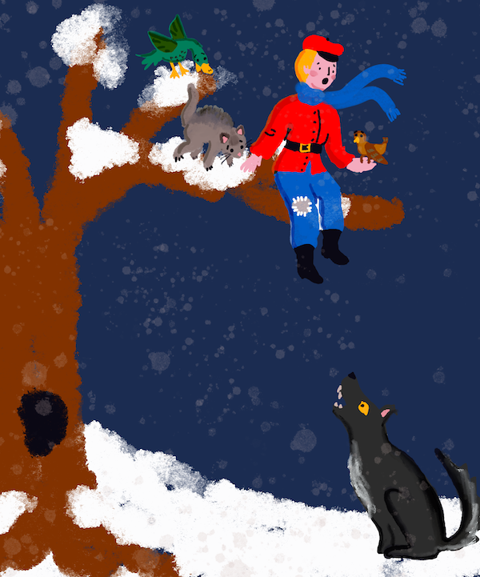

# Introduction to reinforcement learning

Reinforcement learning, RL, is seen as one of the basic machine learning paradigms, next to supervised learning and unsupervised learning. RL is all about decisions: delivering the right decisions or at least learning from them.

Imagine you have a simulated environment such as the stock market. What happens if you impose a given regulation? Does it have a positive or negative effect? If something negative happens, you need to take this _negative reinforcement_, learn from it, and change course. If it's a positive outcome, you need to build on that _positive reinforcement_.

> Peter and his friends need to escape the hungry wolf! Image by [Jen Looper](https://twitter.com/jenlooper)

## Regional topic: Peter and the Wolf (Russia)

[Peter and the Wolf](https://en.wikipedia.org/wiki/Peter_and_the_Wolf) is a musical fairy tale written by a Russian composer [Sergei Prokofiev](https://en.wikipedia.org/wiki/Sergei_Prokofiev). It is a story about young pioneer Peter, who bravely goes out of his house to the forest clearing to chase the wolf. In this section, we will train machine learning algorithms that will help Peter:

- **Explore** the surrounding area and build an optimal navigation map
- **Learn** how to use a skateboard and balance on it, in order to move around faster.

> 🎥 Click the image above to listen to Peter and the Wolf by Prokofiev

## Reinforcement learning

In previous sections, you have seen two examples of machine learning problems:

- **Supervised**, where we have datasets that suggest sample solutions to the problem we want to solve. [Classification](../4-Classification/README.md) and [regression](../2-Regression/README.md) are supervised learning tasks.
- **Unsupervised**, in which we do not have labeled training data. The main example of unsupervised learning is [Clustering](../5-Clustering/README.md).

In this section, we will introduce you to a new type of learning problem that does not require labeled training data. There are several types of such problems:

- **[Semi-supervised learning](https://wikipedia.org/wiki/Semi-supervised_learning)**, where we have a lot of unlabeled data that can be used to pre-train the model.
- **[Reinforcement learning](https://wikipedia.org/wiki/Reinforcement_learning)**, in which an agent learns how to behave by performing experiments in some simulated environment.

### Example - computer game

Suppose you want to teach a computer to play a game, such as chess, or [Super Mario](https://wikipedia.org/wiki/Super_Mario). For the computer to play a game, we need it to predict which move to make in each of the game states. While this may seem like a classification problem, it is not - because we do not have a dataset with states and corresponding actions. While we may have some data like existing chess matches or recording of players playing Super Mario, it is likely that that data will not sufficiently cover a large enough number of possible states.

Instead of looking for existing game data, **Reinforcement Learning** (RL) is based on the idea of *making the computer play* many times and observing the result. Thus, to apply Reinforcement Learning, we need two things:

- **An environment** and **a simulator** which allows us to play a game many times. This simulator would define all the game rules as well as possible states and actions.

- **A reward function**, which would tell us how well we did during each move or game.

The main difference between other types of machine learning and RL is that in RL we typically do not know whether we win or lose until we finish the game. Thus, we cannot say whether a certain move alone is good or not - we only receive a reward at the end of the game. And our goal is to design algorithms that will allow us to train a model under  uncertain conditions. We will learn about one RL algorithm called **Q-learning**.

## Lessons

1. [Introduction to reinforcement learning and Q-Learning](1-QLearning/README.md)
2. [Using a gym simulation environment](2-Gym/README.md)

## Credits

"Introduction to Reinforcement Learning" was written with ♥️ by [Dmitry Soshnikov](http://soshnikov.com)
